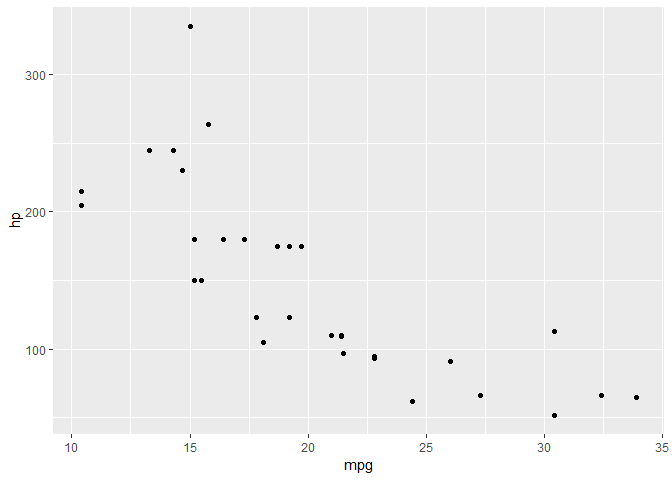

test.R
================
Michael.Flanigan
Tue Jan 15 18:01:57 2019

``` r
library(ggplot2)
library(dplyr)
```

    ## 
    ## Attaching package: 'dplyr'

    ## The following objects are masked from 'package:stats':
    ## 
    ##     filter, lag

    ## The following objects are masked from 'package:base':
    ## 
    ##     intersect, setdiff, setequal, union

``` r
data("mtcars")

mtcars %>% ggplot(aes(mpg,hp))+geom_point()
```



``` r
mtcars %>% 
  group_by(cyl) %>% 
  count()
```

    ## # A tibble: 3 x 2
    ## # Groups:   cyl [3]
    ##     cyl     n
    ##   <dbl> <int>
    ## 1     4    11
    ## 2     6     7
    ## 3     8    14
